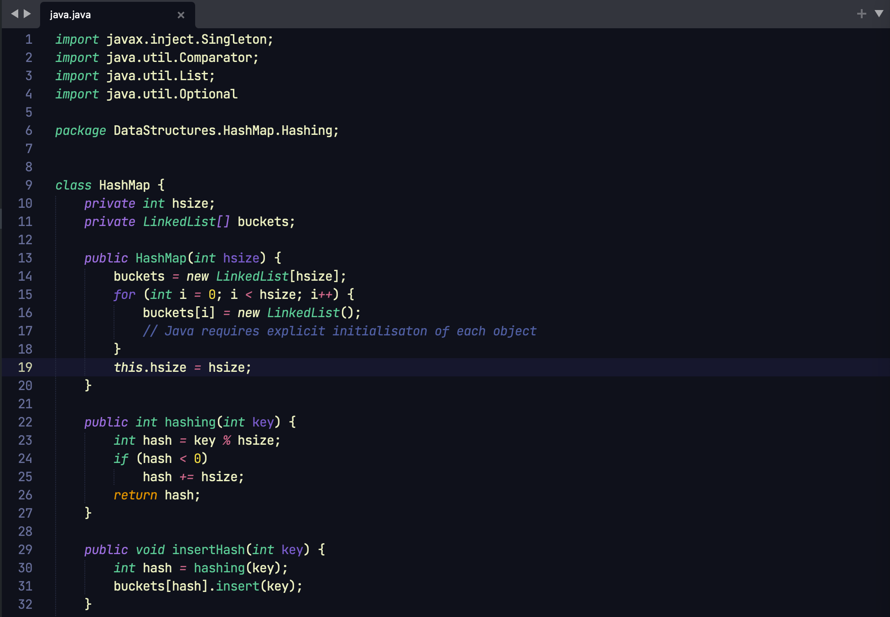
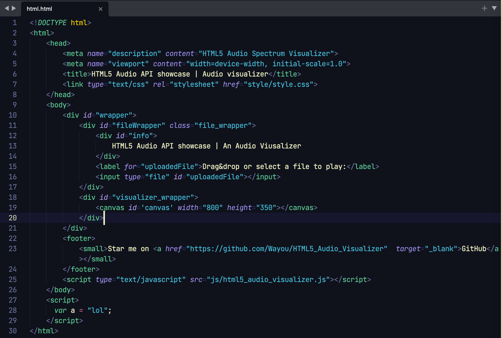
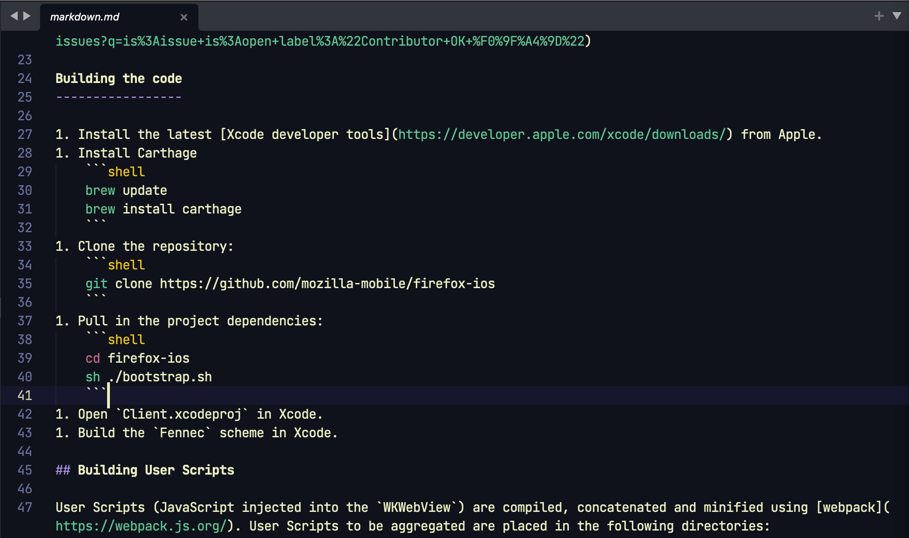

# SpaceDuck Color Scheme for Sublime Text

[SpaceDuck](https://github.com/pineapplegiant/spaceduck) color scheme for [Sublime Text](https://www.sublimetext.com/). Generated from the [SpaceDuck VS Code theme](https://github.com/spaceduck-theme/vscode) using [code-theme-converter](https://github.com/tobiastimm/code-theme-converter).

### Screenshots

*Code examples taken from [spaceduck-theme/spaceduck](https://github.com/spaceduck-theme/spaceduck)*

